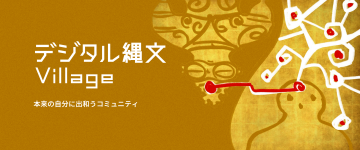
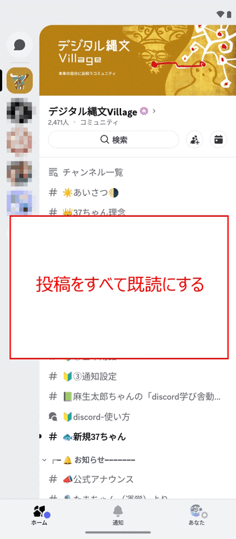
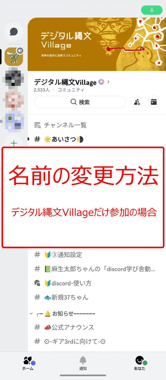
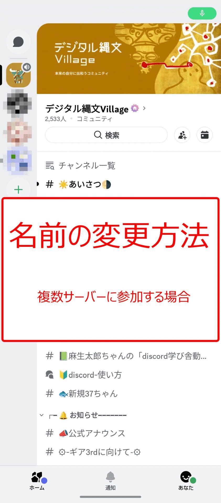
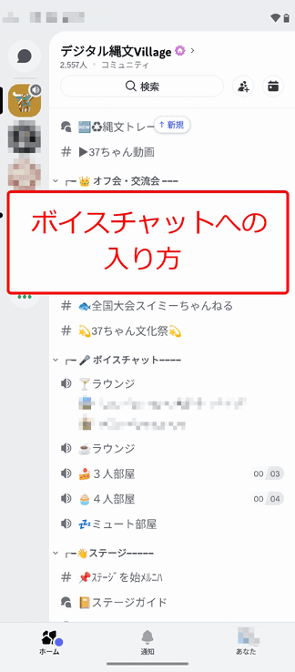
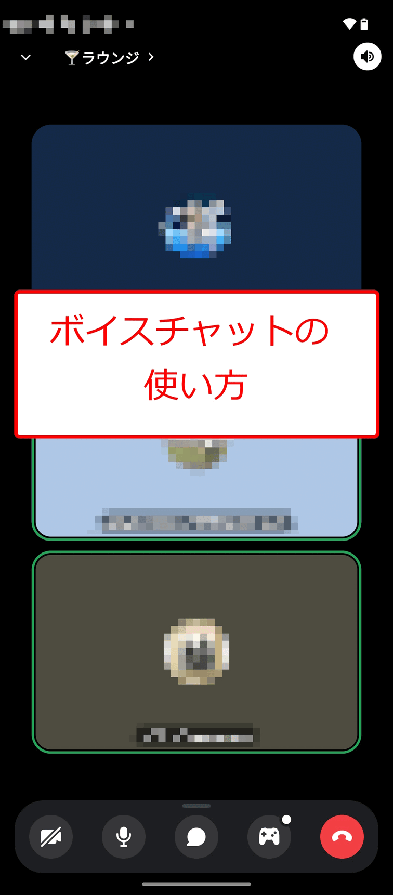

# ルールと使い方

**バージョン**: 1.0
**最終更新**: 2025年10月3日  

## 📋 目次

1. [投稿をすべて既読にする](#投稿をすべて既読にする)
2. [名前の変更](#名前の変更)
3. [ボイスチャット（ボイチャ）](#ボイスチャット（ボイチャ）)

---

## 投稿をすべて既読にする

**初めてDiscordサーバーに参加した人**や**長期間Discordを見ていなかった人**は、大量の未読投稿によって、コミュニティの最新の情報に気付き難くなってしまいます。

このような場合は、以下の方法で**投稿をすべて既読にすることをお薦めします**。

投稿をすべて既読にすることで、最新の情報に気付きやすくなります。

---

## 名前の変更

デジタル縄文Villageサーバーでは、名前のあとに「居住エリア」が表示されるように変更をお願いしています。

### 名前の変更をお願いする理由：
🐟 ①同じ名前の人の区別がしやすい。\
🐟 ②オフ会の時にお誘いや開催の協力がしやすい。\
🐟 ③災害時のため。\
🐟 ④最低限の簡単なルールを作る事でコミュニティへの参加意思が確認でき、ひやかしや興味本位で見ている人を弾け、荒らしの対策にもなる。

特に④が主要な理由です。

「名前 in 居住エリア」\
 （例： 「 036ちゃん in 渋谷代官山 」 ）

⚠ **名前の変更をしていただけない方は定期的にチェックして退会とさせていただきます** ⚠

### 名前の変更方法
Discordでメッセージを投稿した際に表示される名前は、以下の優先順位で決まります。\
① サーバーニックネーム （ 「プロフィール編集」→「サーバーごとのプロフィール」 ）\
② 表示名 （ 「プロフィール編集」→「メインプロフィール」 ）\
③ ユーザー名 （ 「設定」→「アカウント」→「セキュリティ」 ）

名前の変更方法は、あなたがDiscordで参加するサーバーによっていずれかを選んでください。\
A. デジタル縄文Villageだけに参加する場合（はじめてDiscordを使う方）\
B. 複数サーバーに参加する場合（既にDiscordを使っている方）

#### 【A. デジタル縄文Villageだけに参加する場合】

「表示名」に居住エリアをつけて設定し、「サーバーニックネーム」は何も設定しません。

#### 【B. 複数サーバーに参加する場合】

「表示名」に居住エリアをつけずに設定し、「サーバーニックネーム」に居住エリアをつけて設定します。

---

## ボイスチャット（ボイチャ）

デジタル縄文Villageサーバーでは、音声で他の人とコミュニケーション（ボイスチャット）をすることができます。\
（カメラをONにすればビデオチャットもできます）

### 【ボイスチャットへの入り方】

### 【ボイスチャットの使い方】

---

## 📝 更新履歴

- **v1.0** (2025年10月3日): 初回リリース

---

**© 2025 デジタル縄文Village**